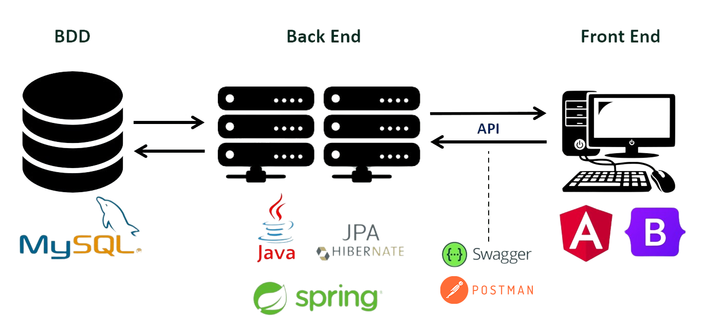

<!--_backgroundColor: white-->

*Système de Gestion des Cursus de Formation*

---
<!--_color: white -->
Sommaire
---

- [Context](#context)
- [Les techno utilisées](#les-techno-utilisées)
- [Diagramme de classe](#diagramme-de-classe)
- [L'organisation](#lorganisation)
- [Démonstration](#démonstration)
- [Perspective d'amélioration](#perspective-damélioration)
- [Rétrospective \& F.A.Q](#rétrospective--faq)

---

<!--_color: white -->
Context
===
La FACTORY: École de formation professionnelle.
Objectif: Informatiser l’organisation des cursus de formation pour éliminer les doublons de saisie et simplifier la gestion.

<!--

description:  du Système

Gestion des Ressources

Matérielles: Ordinateurs, Vidéoprojecteurs, Salles.
Humaines: Gestionnaire, Technicien, Formateur, Stagiaire.
Modules Fonctionnels

Gestion des Matières

Ajout de matières: titre, durée, objectifs, prérequis, contenu.
Gestion des Formateurs

Attribution et recherche de compétences.
Mise à jour des disponibilités.
Gestion des Plannings

Planification des cursus: gestionnaire, dates, matières, salles, formateurs, stagiaires, matériel.
Alertes de disponibilité.
Gestion du Matériel

Prévision à 6 mois des besoins matériels.
Alertes en cas de manque de stock.
Gestion des Salles

Vue d'occupation des salles.
Adaptation des formations selon la capacité.
Accès et Sécurité

Accès sécurisé et authentifié.
Rôles: Administrateur, Gestionnaire de planning, Formateur, Technicien.

-->

---
<!--_color: white -->
## Les techno utilisées

<!-- 
**Points importants**

* Avec Angular nous pouvons créer rapidement plusieurs interfaces utilisateurs dynamique qui communique avec notre API
(Application Programming interface).
* Avec Spring Boot nous avons créer cette API avec laquelle nous pouvons contrôler les données rentrantes et les inserer en base de données ou renvoyer une erreur aux utilisateurs.
* Avec Mysql nous pouvons centraliser les données des utlisateurs ainsi que les données nécessaires au bon fonctionnement de l'API. 
* Swagger nous permet d'avoir une documentation claire pour les applications Angulars.
* Postman pour faire des requêtes HTTP
-->

---
<!--_color: white -->
## Diagramme de classe

<!-- Le diagramme de classe final, avec l'avancement du projet le diagramme initial à dû etre modifié. -->

---
<!--_color: white -->
## L'organisation

|    Backend    |                 |     Frontend     |
| :-----------: | :-------------: | :--------------: |
| Damien COLSON |                 |  Steven LECLERC  |
|  Noah FIQUET  |                 | Stephanie CANUEL |
|               | Pierre CARBONNE |

---
<!--_color: white -->
**Git**

<!-- Chaque branche est une fonctionnalitée ou une fusion -->

---
<!--_color: white -->
Démonstration
===

---
<!--_color: white -->
## Perspective d'amélioration

---
<!--_color: white -->
# Rétrospective & F.A.Q